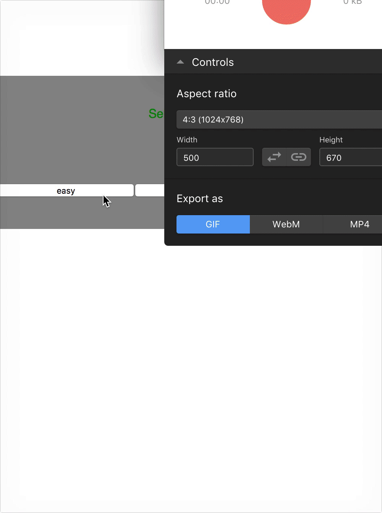

# Minesweeper

An app built using a big back-end API to calculate logic. Styling was never completed but the logic of the API calls is solid. Really hammered home how incredible having a good back-end can be for a developer. 
